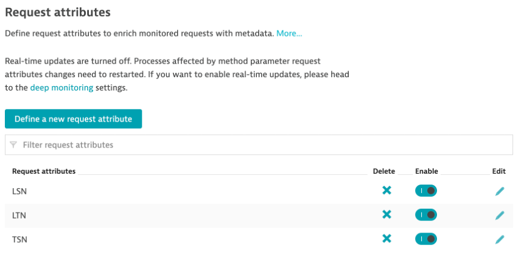
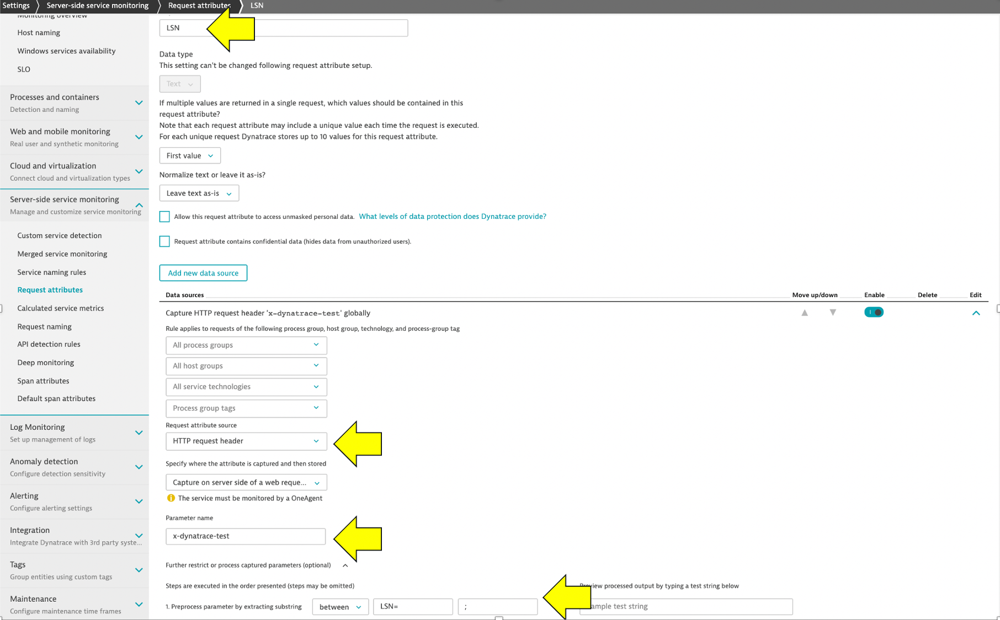
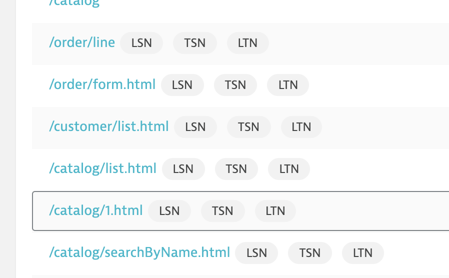
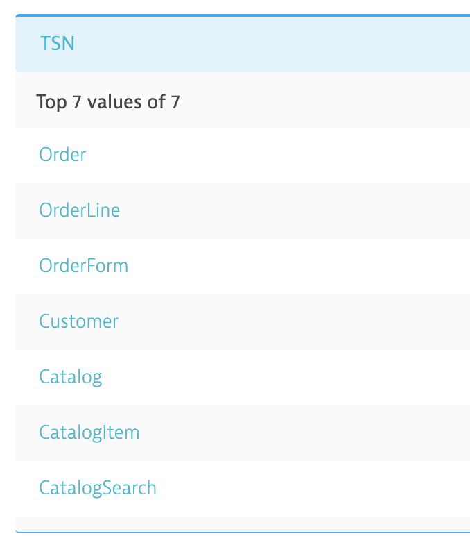

# Overview

This is a simple script to send some load traffic using JMeter to the dt-orders app with a configurable loop count and base URL. The JMeter test script is build into the image so there is no need to Docker volumes.

# Running

Assuming the dt-orders app is running, start docker with this command and adjust arguments as needed.  

NOTE: 172.17.0.1 is a special IP within Docker that refers to the host that is running the Docker image

```
docker run -it \
    --env SERVER_URL=172.17.0.1 \
    --env SERVER_PORT=80 \
    --env NUM_LOOPS=1000 \
    --env NUM_THREADS=1 \
    --env THINK_TIME=250 \
    --env TEST_SCRIPT="/load.jmx"
    dtdemos/dt-orders-load:1
```

Use `run.sh` as a helper script to test the docker image using `docker run` command

```
# example override of URL and PORT, run for 1 loops, 1 thread, 250ms thinktime, and debug OFF
./run.sh 172.17.0.1 80 1 1 250 load.jmx false

# example override of URL and PORT, run for 1 loops, 1 thread, 250ms thinktime, and debug ON
./run.sh 44.234.152.110 80 1 1 250 load.jmx true
```

# Development

## Prerequisites - This is setup on a mac

* JMeter 5.2.1 or higher
* Docker

```
brew install jmeter
```

## Develop and Test

* Use the JMeter UI to edit the script.  
* Use `buildpush.sh` to build and push the Docker image
* Use `load.sh` as a helper script to test the `jmeter` executable directly

    ```
    # example override of URL and PORT, run for 1 loops, 1 thread, 250ms thinktime, and debug ON
    ./load.sh 3.224.9.137 80 1 1 250 load.jmx true

    # example override of URL and PORT, run for 1 loops, 1 thread, 250ms thinktime, and debug OFF
    ./load.sh localhost 80 1 1 250 load.jmx false
    ```

# Dynatrace Setup

The script send a custom header with the script information that can be pulled out as [Dynatrace request attributes](https://www.dynatrace.com/support/help/how-to-use-dynatrace/transactions-and-services/basic-concepts/request-attributes/).  

You will need to configure these three as show below.





Here is how they look once they are configured.



